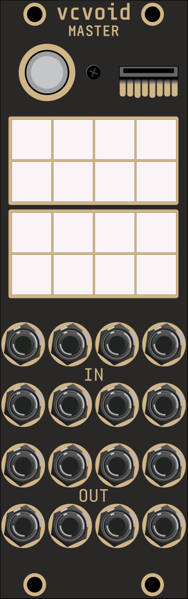
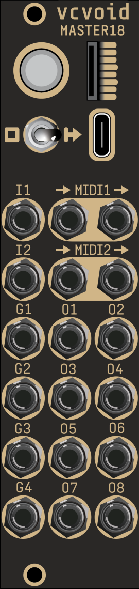
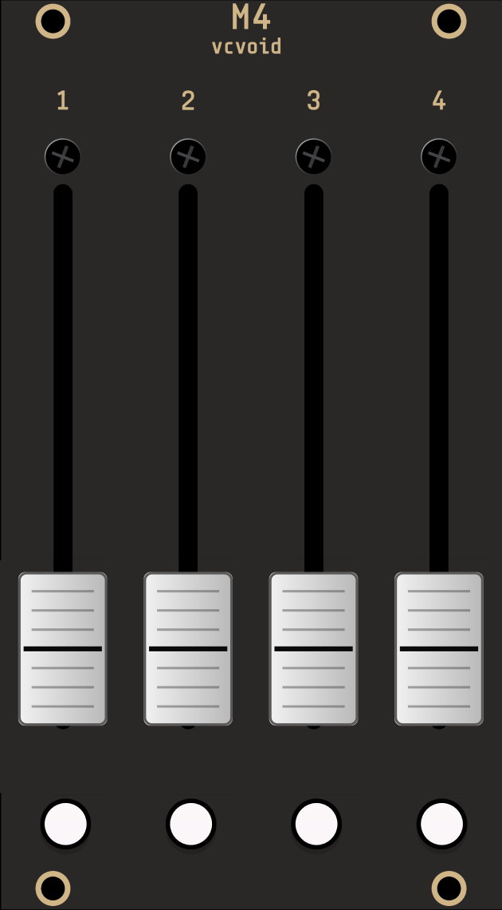
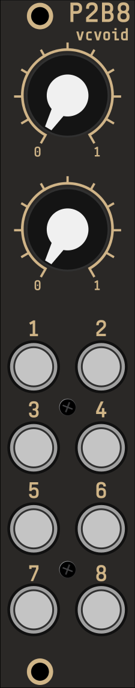
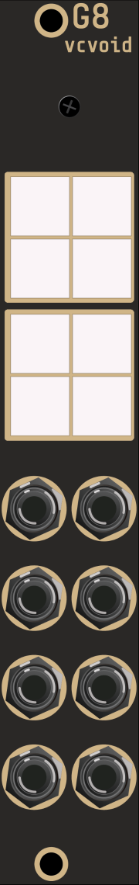

# vcvoid

> **Not affiliated with, or endorsed by, Der Mann mit der Maschine.** "DROID" is
> a trademark of Der Mann mit der Maschine. This is an independent, fan-made
> emulation. See [Trademark & attribution](#trademark--attribution).

**vcvoid is a [VCV Rack 2](https://vcvrack.com/) plugin that emulates the
[DROID](https://shop.dermannmitdermaschine.de/) modular CV processing system.**

vcvoid runs *real* `droid.ini` patch files — the same text patches you write in
the [DROID Forge](https://github.com/Zarkuun/droidforge) or edit by hand for
the physical hardware — inside VCV Rack, reproducing the behavior of the DROID
master and its controllers/expanders. Point the virtual master at a patch file
and it sequences, quantizes, generates envelopes/LFOs/randoms, switches, mixes,
and bridges MIDI exactly as the hardware does (modulo hardware-only physics
like motor-fader haptics).

All DROID circuits are implemented except three that are inherently
hardware-bound and out of scope (`firefacecontrol`, `outputcalibrator`,
`sinfonionlink`).

### Why?
`vcvoid` can be super useful for droid patch development and testing: bring up [DROID Forge](https://github.com/Zarkuun/droidforge) in one half of your window and [VCV Rack 2](https://vcvrack.com/) in the other, and see the effects of your patch edits in real-time on a real-ish patch before you load it into hardware.
It's also quite helpful if you don't yet have a droid hardware system and are curious about it. Patch up your dream sequencer and play with it in [VCV Rack 2](https://vcvrack.com/). It should be noted though, that there is nothing like playing live with a real hands-on droid system (especially with m4s!)

## Screenshots

| master | master18 | m4 | p2b8 | g8 |
|:------:|:--------:|:--:|:----:|:--:|
|  |  |  |  |  |

## Modules

The plugin appears in Rack under the brand **vcvoid** and provides 14 modules:

| Module | What it is |
|--------|------------|
| **master** | Emulates the DROID MASTER: 8 CV in / 8 CV out master; runs the patch. |
| **master18** | Emulates the DROID MASTER18: 8 CV outs, 2 gate ins, 4 gate outs, USB + 2×TRS MIDI, VCO tuner. |
| **p2b8** | Emulates the DROID P2B8 controller — 2 pots, 8 buttons with LEDs. |
| **p4b2** | Emulates the DROID P4B2 controller — 4 pots, 2 buttons with LEDs. |
| **p10** | Emulates the DROID P10 controller — 10 pots. |
| **s10** | Emulates the DROID S10 controller — 2 rotary + 8 toggle switches. |
| **p8s8** | Emulates the DROID P8S8 controller — 8 sliders with LEDs, 8 toggle switches. |
| **b32** | Emulates the DROID B32 controller — 32 buttons with LEDs. |
| **e4** | Emulates the DROID E4 controller — 4 endless encoders with push + value rings. |
| **m4** | Emulates the DROID M4 controller — 4 motor faders with touch + RGB LEDs. |
| **db8e** | Emulates the DROID DB8E controller — 8 buttons, encoder, 128×64 display. |
| **g8** | Emulates the DROID G8 gate expander — 8 gate ins, 8 gate outs (5 V). |
| **x7** | Emulates the DROID X7 expander — USB + TRS MIDI, 4 gate outputs (first in chain). |
| **bling** | 1 HP blind panel — chain pass-through. |

## Using the modules

1. Add a **master** (or **master18**) module from the `vcvoid` brand.
2. Load a `droid.ini` patch via the master's context menu.
3. Chain controllers and expanders to the **right** of the master. Chain
   position = controller number, exactly like the hardware ribbon chain
   (`P1.2` = pot 2 on the first controller).

Patches can be written in the [DROID Forge](https://github.com/Zarkuun/droidforge)
or any text editor. The DROID reference manual (firmware blue-7) is available
in structured form under [`manual/`](manual/README.md):
[circuits](manual/circuits/index.md), [basics](manual/basics.md),
[hardware](manual/hardware.md), [scales](manual/scales.md). For the original
page renders (diagrams, tables, worked figures), download the **blue-7 DROID
manual** from Der Mann mit der Maschine (shop.dermannmitdermaschine.de →
Downloads) — it is intentionally not redistributed here.

### Claude Code

As a bonus, if you use [Claude Code](https://claude.com/claude-code) you can
have it create and verify a DROID patch for you based on your description!
Run the repo's `/droid-patch` skill from a session in this repository and
describe what you want, e.g.:

```
/droid-patch a three-voice generative arpeggio with a P2B8 controlling
tempo and scale
```

The skill writes the `.ini` file against the structured manual in `manual/`
and validates it with the same checks the DROID Forge uses (via
[`tools/droidcheck`](tools/droidcheck/)) before handing it to you — ready to
load into a vcvoid master, or onto real hardware.

**G8 jacks:** On the hardware, each G8 jack is bidirectional. In vcvoid, each
jack position has split hit-boxes — the **top half** clicks for the input,
**bottom half** for the output. Hover tooltips read `G.n gate in` and
`G.n gate out` to clarify which half is active.

## Installing

vcvoid is not distributed through the VCV Library; install it by building from
source. Building requires the
[VCV Rack SDK](https://vcvrack.com/manual/Building#Setting-up-your-development-environment)
and a C++17 toolchain. macOS is the tested platform; the code should be
portable, but Linux and Windows are unverified — PRs porting or testing there
are always welcome (see [CONTRIBUTING.md](CONTRIBUTING.md)).

```sh
cd plugin
make RACK_DIR=/path/to/Rack-SDK           # build plugin.dylib/.so/.dll
make install RACK_DIR=/path/to/Rack-SDK   # build + copy into Rack's user plugin folder
```

`RACK_DIR` defaults to `../../Rack-SDK`; pass it explicitly if the SDK lives
elsewhere. After `make install`, launch VCV Rack and the modules appear under
the `vcvoid` brand.

## Development

Under the hood, a pure Rack-independent C++17 DROID engine (`engine/`) does
the work — parser, registers, cables, input math, kernel loop, RAM
accounting — and the Rack plugin (`plugin/`) wraps it. The engine is verified
headlessly by golden tests and cross-checked against the DROID Forge's own
validator; no Rack install is needed to run them:

```sh
make test         # unit tests + golden circuit tests (+ layout/art checks if deps present)
make crosscheck   # validate golden patches against the DROID Forge (parity oracle)
```

- [`CONTRIBUTING.md`](CONTRIBUTING.md) — dev setup, test suites, and how to
  add a circuit.
- [`architecture.md`](architecture.md) — engine + plugin design, the tick
  model, and the verification harness.
- [`docs/implementation-system.md`](docs/implementation-system.md) — the
  goldens-first, circuit-by-circuit implementation pipeline.
- [`circuits-status.yaml`](circuits-status.yaml) — the per-circuit
  implementation ledger.

## License

vcvoid is licensed **GPL-3.0-or-later**. See [LICENSE](LICENSE).

## Trademark & attribution

- **DROID** is a hardware product and trademark of **Der Mann mit der Maschine**
  (Zürich). This project is an independent, unofficial emulation and is **not
  affiliated with or endorsed by** Der Mann mit der Maschine. Product and circuit
  names are used only to describe compatibility.
- **Faceplate art** (`plugin/res/faceplates/*.png`) is derived from the GPL-3
  licensed [Zarkuun/droidforge](https://github.com/Zarkuun/droidforge) faceplate
  renders (© Der Mann mit der Maschine) **with the author's permission**, on the
  condition that the DROID name and DROID/DMMDM branding are removed — hence the
  vcvoid wordmark and de-branded panels. The wordmark uses Share Tech Mono (OFL).
  A public permission request to the faceplate author (@Zarkuun) is tracked in
  [issue #1](https://github.com/vyger/vcvoid/issues/1).
- The **`manual/`** tree is a restructured, machine-readable **derivative of the
  official DROID manual** (firmware blue-7, © Der Mann mit der Maschine). It is
  reproduced here as documentation-of-record for building a faithful emulation —
  not as original work. The source `droid-manual-blue-7.pdf` is intentionally
  **not** redistributed (it is git-ignored).
- **DROID Forge** (© Der Mann mit der Maschine / Zarkuun, GPL-3) is used as the
  parity oracle and as the source of `droidfirmware.json` for code generation.

See [NOTICE](NOTICE) for a consolidated third-party attribution summary.
